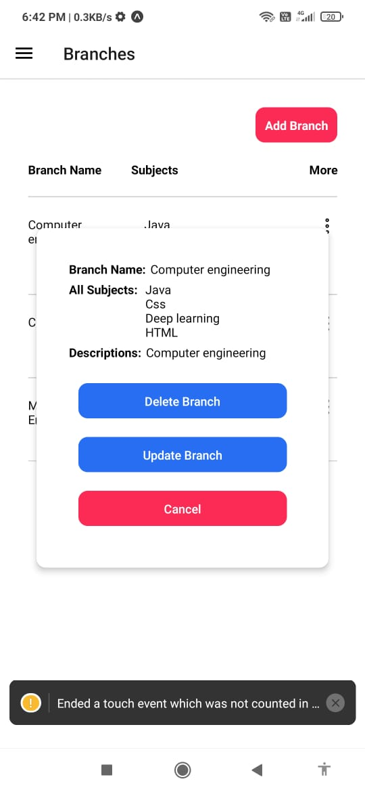

e-learning-app
react navigation dependencies
npm install @react-navigation/native
npm install react-native-screens react-native-safe-area-context
npm install @react-navigation/native-stack
react-native-screens package requires one additional configuration step to properly work on Android devices. Edit MainActivity.java file which is located in android/app/src/main/java//MainActivity.java.

Add the highlighted code to the body of MainActivity class:

public class MainActivity extends ReactActivity { // ... @Override protected void onCreate(Bundle savedInstanceState) { super.onCreate(null); } // ... }

and make sure to add the following import statement at the top of this file below your package statement:

import android.os.Bundle;
node module delete command:- rm -r node_modules

make android emulator to using metro

cd android
./gradlew assembleDebug

Images

